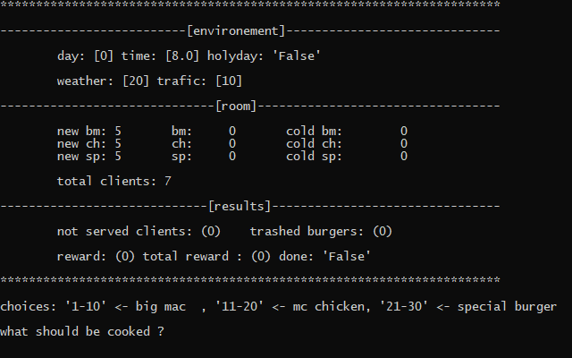
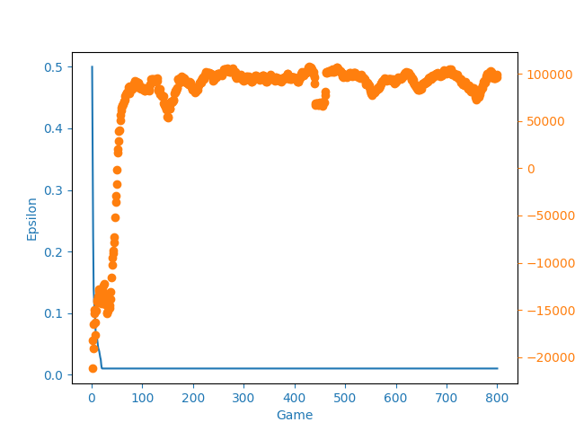

# Solving logistics with DeepQLearning
## TL;DR
```
After about 100 days/games it achive maximum rewards
eg: Trashing no burgers, making no customers wait
```
## The Game


### Base :
- There is a random number of customers coming to a burger shop each 10 minutes
- Each one order randomly one burger
### There is more customers if :
- It's lunch or diner time
- It's a hollyday
- It's sunny
- There is low trafic
### Other rules :
- During lunch they tend to order more bigmac
- On hollydays they tend to order more specials
### Burger rules:
- The burger shop can make between 3 to 30 burgers each 10 minutes
- Only one kind is made each time
- Burgers are trashed after 30 mintes on the shelf
### how to win maximum reward ?
- There should be no customer waiting more than 10 minutes to get his burger
- There should be no trashed burgers

## Result


the agent manage to make perfect jujement after 100 days/games using 3 convolution network and 2 hidden layers to make the decision

## Install env :
```bash
$ conda create --name mcdo --file requirements_conda.txt
$ conda activate mcdo
```
### Try the agent :
```bash
$ python ntest.py
```
### Try to beat the agent :
```bash
$ python htest.py
```
### Run random choice maker :
```bash
$ python rtest.py
```
